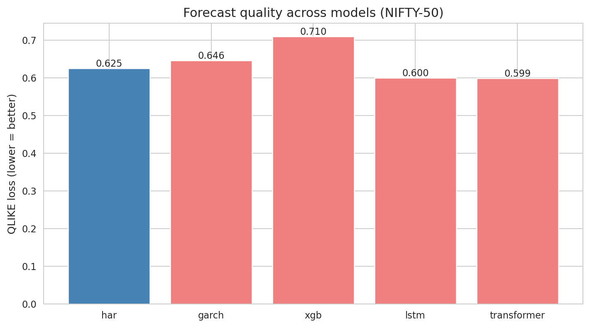
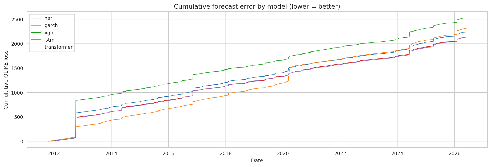

# 📉 nifty-vol-forecast

> Realized volatility forecasting for NIFTY 50 using transformer architectures, benchmarked against GARCH-family classical baselines on NSE bhavcopy data.


## Research question

Do transformer-based sequence models outperform classical GARCH-family forecasts of realized volatility on Indian equity index data, and if so, under what market regimes is the improvement concentrated?

## Why NIFTY 50

The Indian volatility forecasting literature is sparse relative to US/European markets. NIFTY 50 has high liquidity, clean public data, distinct intraday/overnight microstructure, and pronounced regime shifts (election cycles, RBI policy, global risk-on/off). This makes it a meaningful testbed for sequence models — and an underexplored corner of the ML4Finance literature.

## Approach

A controlled head-to-head comparison of four model families on the same task: 1-day, 5-day, and 22-day ahead realized volatility forecasts.

### Classical baselines

1. **GARCH(1,1)** — Bollerslev (1986). The standard.
2. **EGARCH(1,1,1)** — Nelson (1991). Captures asymmetric leverage effect.
3. **HAR-RV** — Corsi (2009). Heterogeneous autoregressive on realized variance.
4. **Realized GARCH** — Hansen, Huang & Shek (2012). Couples returns and realized measures.

### Machine learning models

5. **XGBoost** — Trained on engineered features (lagged RV, lagged returns, range-based estimators, volume features).
6. **LSTM** — Direct sequence modeling on returns + realized variance series.
7. **Temporal Fusion Transformer (TFT)** — Lim et al. (2020). Attention-based with interpretable feature importance.
8. **Vanilla Transformer encoder** — Custom architecture with positional encoding for daily sequences.

### Evaluation

- **QLIKE loss** (preferred for volatility — penalizes underprediction more)
- **MSE on log-volatility**
- **Mincer-Zarnowitz regression** for unbiasedness
- **Diebold-Mariano test** for statistical significance of pairwise model differences
- **Out-of-sample R²** vs. naïve persistence forecast
- **Regime-conditional performance** — split test set into low-vol / high-vol / crisis regimes

All models trained with strict walk-forward expanding window cross-validation. Final evaluation on a held-out 2024-2025 out-of-sample window.

## Data

- **NSE Bhavcopy daily data** — open/high/low/close/volume for NIFTY 50 from 2007 to present (public, free)
- **High-frequency NIFTY data** (where available) for computing intraday realized variance
- Optional: India VIX as a complementary regressor

Data fetched via:
- `nsepy` Python package, or
- Direct NSE archive downloads

## Planned repo structure

```
nifty-vol-forecast/
├── README.md
├── LICENSE
├── requirements.txt
├── data/                       # raw and processed data (gitignored)
│   ├── raw/                    # NSE bhavcopy CSV dumps
│   └── processed/              # parquet files of cleaned series
├── notebooks/
│   ├── 01_data_ingestion.ipynb
│   ├── 02_realized_variance.ipynb
│   ├── 03_garch_baselines.ipynb
│   ├── 04_ml_models.ipynb
│   ├── 05_transformer_model.ipynb
│   └── 06_evaluation_and_results.ipynb
├── src/
│   ├── data/                   # NSE downloaders, realized variance estimators
│   ├── models/
│   │   ├── garch/              # arch package wrappers
│   │   ├── ml/                 # XGBoost training pipeline
│   │   └── deep/               # LSTM, TFT, Transformer
│   ├── training/               # Walk-forward CV harness
│   ├── evaluation/             # QLIKE, MZ regression, DM test
│   └── viz/                    # Plotting utilities
├── results/
│   ├── figures/
│   └── metrics/
└── tests/
```

## Engineered features (for tree/ML models)

- Lagged log realized variance (1, 5, 22 day lags — HAR-style)
- Lagged returns and squared returns
- Range-based estimators: Parkinson, Garman-Klass, Rogers-Satchell, Yang-Zhang
- Volume-derived: volume z-scores, dollar volume, volume-volatility ratio
- Day-of-week, month-of-year dummies
- India VIX level and z-score
- Lagged S&P 500 realized volatility (global spillover)

## Current results

**Dataset:** NIFTY 50 daily OHLCV, 2007-09-18 to 2026-06-01 (4,585 trading days, ~3,500 out-of-sample forecasts per cell).
**Realized variance estimator:** Yang-Zhang.
**Walk-forward:** expanding window, initial training = 1,000 days, refit every 22 days for GARCH/XGB and every 250 days for deep models.
**Significance test:** Diebold-Mariano on per-observation QLIKE losses (consistent with the primary metric).

### QLIKE by model and horizon (lower is better, best in **bold**)

| Model | h=1 | h=5 | h=22 |
|---|---|---|---|
| HAR-RV (baseline) | 0.625 | 0.708 | 0.969 |
| GARCH(1,1) | 0.646 | **0.685** | **0.760** |
| XGBoost | 0.710 | 0.744 | 0.985 |
| LSTM | **0.600** | 0.683 | 0.902 |
| Transformer | 0.599 | 0.696 | 1.006 |

### Diebold-Mariano vs HAR-RV (QLIKE-based)

| h | Model | DM | p-value | Verdict |
|---|---|---|---|---|
| 1 | LSTM | +0.95 | 0.34 | not significant |
| 1 | Transformer | +0.87 | 0.39 | not significant |
| 1 | GARCH | -0.24 | 0.81 | not significant |
| 1 | XGBoost | -1.09 | 0.28 | not significant |
| 5 | GARCH | +0.40 | 0.69 | not significant |
| 5 | LSTM | +0.94 | 0.35 | not significant |
| 5 | **XGBoost** | **-2.28** | **0.023** | **XGB significantly worse than HAR (**)** |
| 5 | Transformer | +0.55 | 0.58 | not significant |
| 22 | GARCH | +1.19 | 0.23 | not significant |
| 22 | LSTM | +1.39 | 0.16 | not significant |
| 22 | XGBoost | -0.36 | 0.72 | not significant |
| 22 | Transformer | -0.66 | 0.51 | not significant |

### Headline takeaway

Across all 12 model-horizon combinations tested, no challenger achieves a statistically significant QLIKE improvement over HAR-RV on this single Indian index. Numerical differences exist (LSTM lowest at h=1, GARCH lowest at h=22) but lie within the noise band of QLIKE-based DM tests.

The only statistically significant result is the opposite direction: **XGBoost is significantly worse than HAR at h=5**.

**Relation to Christensen et al. (2023):** Their cross-sectional benchmark on DJIA constituents finds ML *beats* the HAR lineage on US equities, with gains intensifying at longer horizons. Our numerical results agree in direction (LSTM/Transformer best at h=1, GARCH best at h=22) but our single-index design has substantially less statistical power than a 30-stock panel, and our QLIKE-consistent DM tests are more conservative than DM tests run on squared log errors. We report our null as a single-index Indian-market replication, not as evidence overturning their result.

### Methodological note

An earlier version of this analysis computed DM tests on squared log forecast errors (MSE on log-variance) rather than on QLIKE per-observation losses. Those tests gave the appearance of significant deep-model advantage at h=1 (LSTM DM=+5.78, Transformer DM=+2.23). When DM tests are computed consistently with the primary metric (QLIKE), no advantage rises to significance. See Patton (2011) and Patton & Sheppard (2009) on this consistency requirement.





## Reproducibility

```bash
git clone https://github.com/manavmishra-cloud/nifty-vol-forecast.git
cd nifty-vol-forecast
pip install -r requirements.txt

# Download data
python -m src.data.download_bhavcopy --start 2007-01-01 --end 2025-05-31

# Compute realized variance
python -m src.data.compute_realized_variance

# Train all models
python -m src.training.train_all --config configs/default.yaml

# Evaluate
python -m src.evaluation.evaluate --results-dir results/
```

## Key references

- Bollerslev, T. (1986). *Generalized Autoregressive Conditional Heteroskedasticity*. Journal of Econometrics.
- Engle, R. F. (1982). *Autoregressive Conditional Heteroscedasticity*. Econometrica.
- Corsi, F. (2009). *A Simple Approximate Long-Memory Model of Realized Volatility*. JFE.
- Hansen, P. R., Huang, Z., & Shek, H. H. (2012). *Realized GARCH: A joint model for returns and realized measures of volatility*. Journal of Applied Econometrics.
- Lim, B., Arık, S. Ö., Loeff, N., & Pfister, T. (2020). *Temporal Fusion Transformers for Interpretable Multi-horizon Time Series Forecasting*. arXiv:1912.09363.
- Patton, A. J. (2011). *Volatility forecast comparison using imperfect volatility proxies*. Journal of Econometrics.

## Planned arXiv submission

Manuscript in preparation — target submission Q1 2027 to `q-fin.ST` (Statistical Finance) on arXiv.

## License

MIT — see [LICENSE](LICENSE)

## Contact

Manav Mishra · [LinkedIn](https://linkedin.com/in/manav-mishra-23a26b308) · manavmishra260205@gmail.com
